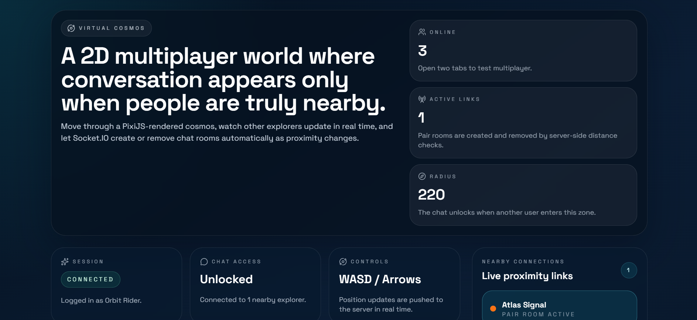
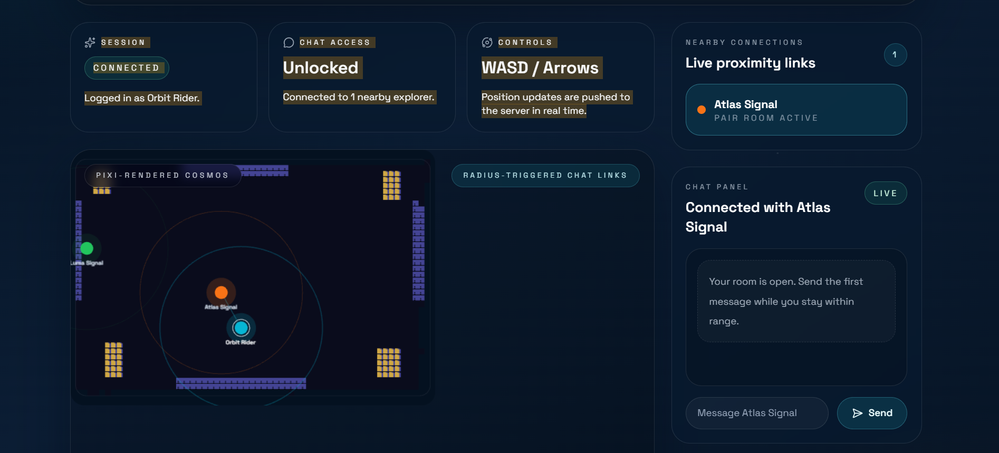
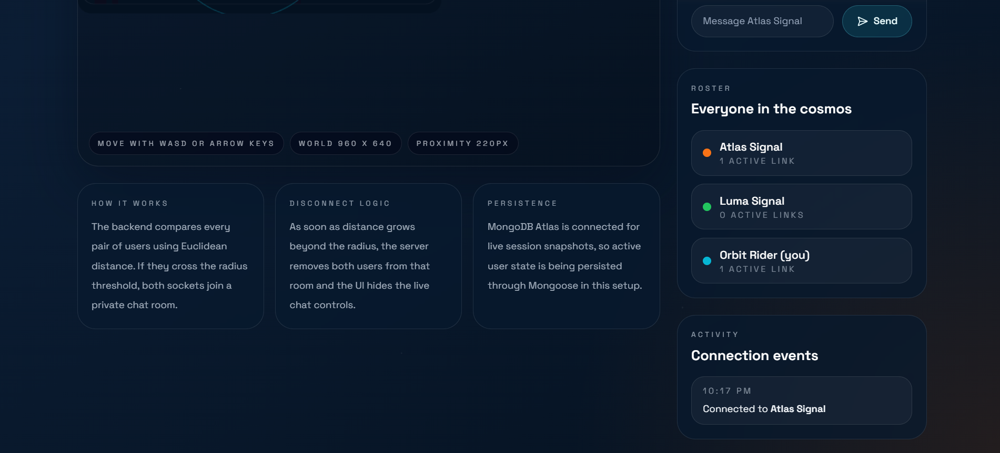

# Virtual Cosmos

Virtual Cosmos is a 2D proximity-based multiplayer environment built for the assignment brief. Users enter a shared world, move with `WASD` or arrow keys, see other users in real time, and automatically gain or lose chat access depending on distance.

## Demo

Demo video:

[](assets/demo/cosmos-assignment.mp4)

Direct video link: [cosmos-assignment.mp4](assets/demo/cosmos-assignment.mp4)

### Screenshots






## What's Implemented

- Real-time multiplayer movement with Socket.IO
- PixiJS-rendered 2D world with avatars, proximity rings, and live connection lines
- Proximity detection on the backend using Euclidean distance
- Automatic pair chat rooms when users come within radius
- Automatic disconnect and chat lock when users move apart
- Responsive React UI with active connections, roster, activity feed, and conditional chat panel
- MongoDB Atlas-backed live session snapshots via Mongoose

## Bonus Features 

- Custom uploaded map integrated as the live PixiJS background
- Wall collision system generated from the map so users cannot walk through blocked areas
- MongoDB Atlas persistence for live session snapshots
- In-memory fallback support when MongoDB is unavailable
- Join overlay for entering the cosmos with a display name
- Auto-generated guest names when no name is provided
- Local storage support for remembering the last used display name
- Nearby connections panel for currently active proximity links
- Live roster panel showing all users and active links
- Activity feed for connect and disconnect events
- Safe spawn positioning so users do not spawn inside walls
- Demo assets section with screenshots and walkthrough video
- Git LFS setup for storing the demo video safely in GitHub

## Tech Stack

- Frontend: React, Vite, TypeScript, PixiJS, Tailwind CSS
- Backend: Node.js, Express, Socket.IO, Mongoose
- Persistence: MongoDB Atlas via Mongoose

### MongoDB Atlas Setup

This project is configured to use MongoDB Atlas for live session snapshots through Mongoose.

Atlas setup steps:

1. Create a cluster in MongoDB Atlas.
2. Create a database user in `Database Access`.
3. Add your current IP address in `Network Access`.
4. Open `Connect` -> `Drivers` and copy the Node.js connection string.
5. Paste that URI into `server/.env` as `MONGODB_URI`.

After connecting, the backend persists live session data such as:

- `userId`
- `name`
- `position`
- `activeConnections`
- connection status timestamps

## Project Structure

```text
.
|-- client
|   |-- src
|   |   |-- components/CosmosCanvas.tsx
|   |   |-- hooks/useCosmosSession.ts
|   |   |-- App.tsx
|   |   |-- lib/cosmos.ts
|   |   |-- lib/mapCollision.ts
|   |   `-- types.ts
|   |-- .env.example
|   `-- vite.config.ts
|-- assets
|   `-- demo
|       |-- chat-panel.png
|       |-- cosmos-assignment.mp4
|       |-- overview.png
|       `-- persistence-roster.png
|-- server
|   |-- src
|   |   |-- config.js
|   |   |-- mapCollision.js
|   |   |-- state.js
|   |   |-- utils.js
|   |   `-- persistence/sessionStore.js
|   |-- .env.example
|   `-- index.js
|-- shared
|   `-- mapCollision.json
`-- README.md
```

## How Proximity Works

1. Each connected user has a live `(x, y)` position.
2. On every movement update, the server recalculates the distance between all user pairs.
3. If distance is less than the configured `PROXIMITY_RADIUS`, a deterministic pair room is created.
4. Both sockets join that room and the frontend unlocks the chat panel.
5. If distance becomes greater than or equal to the radius, the room is removed and chat is disabled again.

## Getting Started

### 1. Install dependencies

```bash
npm install
npm install --prefix client
npm install --prefix server
```

### 2. Configure environment variables

Copy the example files:

```bash
copy client\.env.example client\.env
copy server\.env.example server\.env
```

Server settings:

- `PORT=4000`
- `CLIENT_URL=http://localhost:5173`
- `MONGODB_URI=your-mongodb-atlas-uri`
- `WORLD_WIDTH=960`
- `WORLD_HEIGHT=640`
- `PROXIMITY_RADIUS=220`
- `MAX_NAME_LENGTH=20`

Example:

```env
PORT=4000
CLIENT_URL=http://localhost:5173
MONGODB_URI=mongodb+srv://<username>:<password>@<cluster-url>/virtual-cosmos?retryWrites=true&w=majority
WORLD_WIDTH=960
WORLD_HEIGHT=640
PROXIMITY_RADIUS=220
MAX_NAME_LENGTH=20
```

### 3. Start the app

```bash
npm run dev
```

Frontend runs at [http://localhost:5173](http://localhost:5173) and the backend runs at [http://localhost:4000](http://localhost:4000).

## Build

```bash
npm run build
```

## Suggested Demo Flow

1. Open the app in two browser tabs.
2. Enter different names in each tab.
3. Move both avatars around the PixiJS world.
4. Bring them within the proximity radius and show the chat panel appearing.
5. Send messages to demonstrate real-time room chat.
6. Move apart and show the chat panel disabling again.

## API / Socket Events

### Client to server

- `user:join`
- `user:move`
- `chat:send`

### Server to client

- `session:init`
- `world:update`
- `proximity:connected`
- `proximity:disconnected`
- `chat:message`

## Notes

- The frontend is optimized for desktop and mobile layouts.
- MongoDB Atlas is active in the current setup and stores live session snapshots.
- The backend uses simple in-memory room recalculation for proximity checks, which is ideal for the assignment scope and easy to explain in an interview.
- The demo video in `assets/demo/cosmos-assignment.mp4` is tracked with Git LFS so it can be pushed safely to GitHub.
- For larger-scale usage, the next step would be spatial partitioning instead of pairwise checks.
